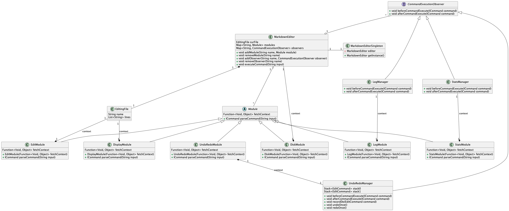
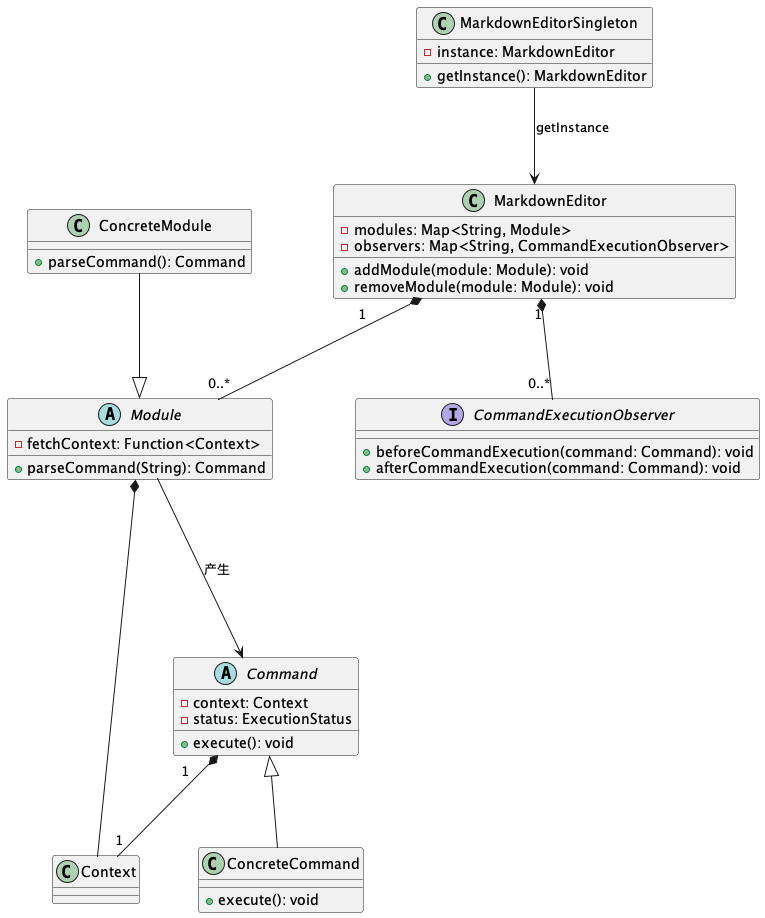
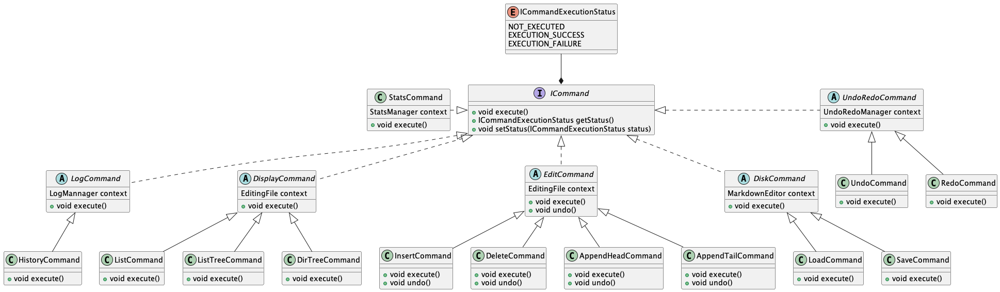
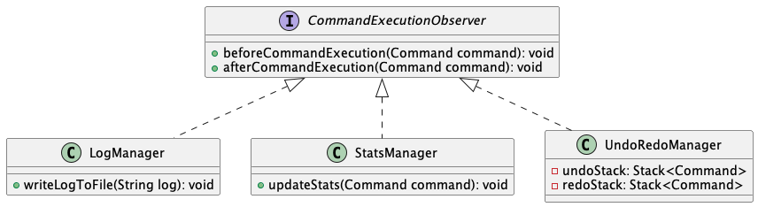
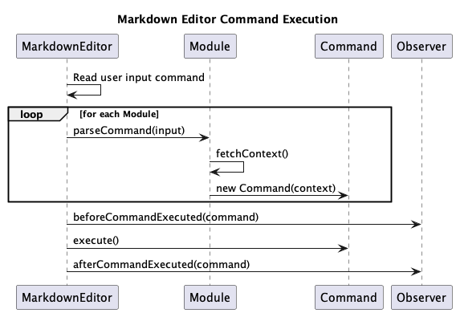
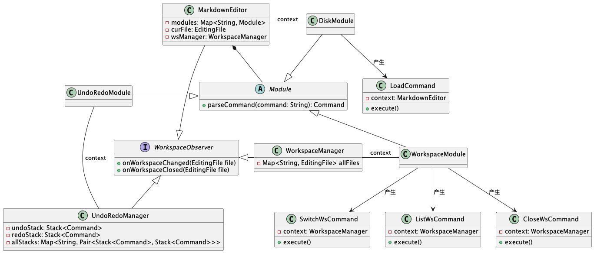

# 高级软件开发技术汇报

> 麻烦同学做一下ppt

## 关键设计决策

### UML类图(main)

该程序的主要类如下图所示：



（不过这张图太大了，上面的字太小了，不是很适合放在一张ppt上。所以上面这张图可以在ppt上一笔带过，然后再放一张下面的图）



- `MarkdownEditorSingleton`：单例模式，用于管理全局唯一的`MarkdownEditor`对象

- `MarkdownEditor`：主类，持有多个`Module`对象，以完成不同的功能
  
- `Module`类：代表一个功能模块。具体的实现对象有`EditorModule`、`DisplayModule`、`DiskModule`、`LogModule`、`StatsModule`、`UndoRedoModule`等。每一个模块都有一`parseCommand(String)`方法，用于解析输入的字符串并产生对应的`Command`对象。`fetchContext`对象用户在解析命令时获得命令执行的上下文，并将其传递给新创建的`Command`对象。

- 不同的`Module`对应不同的`Context`对象。例如`EditorModule`对应的上下文是`EditingFile`，`LogModule`和`StatsModule`对应的上下文分别是`LogManager`和`StatsManager`。

- 调用`Command`对象的`execute()`方法，执行命令，以完成操作
  

#### UML类图(command)

每个`Module`会产生自己对应的`Command`对象。例如`EditorModule`会产生`EditingCommand`对象，`DisplayModule`会产生`DisplayCommand`对象，`DiskModule`会产生`DiskCommand`对象，`LogModule`会产生`LogCommand`对象，`StatsModule`会产生`StatsCommand`对象，`UndoRedoModule`会产生`UndoRedoCommand`对象。



#### UML类图(observer)




使用观察者模式实现了日志记录，统计和撤销重做功能。

- 日志记录功能：`LogManager`类是`LogModule`的上下文，`LogManager`类实现了`CommandExecutionObserver`接口，用于接收`Command`对象的执行通知。`LogManager`接受到通知后，自己在内部实现日志记录的功能。
- 统计功能：`StatsManager`类是`StatsModule`的上下文，`StatsManager`类实现了`CommandExecutionObserver`接口，用于接收`Command`对象的执行通知。`StatsManager`接受到通知后，自己在内部实现统计功能。
- 撤销重做功能：`UndoRedoManager`类是`UndoRedoModule`的上下文，`UndoRedoManager`类实现了`CommandExecutionObserver`接口，用于接收`Command`对象的执行通知。`UndoRedoManager`在内部使用了两个栈`undoStack`和`redoStack`实现撤销重做功能。

#### UML时序图



程序的具体工作流程如下：

- `MarkdownEditor`类从控制台读取用户输入的命令字符串
- `MarkdownEditor`类将输入交给其持有的所有`Module`对象，看看哪个`Module`能够解析这个命令字符串并返回一个`Command`对象。在这个过程中，`Module`对象会调用`fetchContext()`方法，获得命令执行的上下文。并将这个上下文传递给新创建的`Command`对象。
- `MarkdownEditor`类调用其持有的所有观察者的`beforeCommandExecuted()`方法，通知观察者即将开始执行命令
- `MarkdownEditor`类调用`Command`对象的`execute()`方法，执行命令
- `MarkdownEditor`类调用其持有的所有观察者的`afterCommandExecuted()`方法，通知观察者命令执行完毕
  
### 设计原则

- 单一职责原则：每个`Module`和`Command`都只负责实现自己的功能，不会包含其他功能。
- 开放封闭原则：当需要实现新的命令，只需要扩展实现新的`Module`和`Command`，并将新实现的`Module`添加到`MarkdownEditor`中。不需要修改`MarkdownEditor`和原有的`Module`和`Command`。
  
### 设计模式

**单例模式**：`MarkdownEditorSingleton`类是单例模式，用于管理全局唯一的`MarkdownEditor`对象

**观察者模式**：`LogManager`、`StatsManager`和`UndoRedoManager`类都实现了`CommandExecutionObserver`，这是观察者模式，用于实现日志记录、统计和撤销重做功能

**命令模式**：`Command`类是命令模式，用于实现命令的执行

**简单工厂模式**：`Module`的`parseCommand(String)`方法是简单工厂模式，用于根据输入的命令字符串，创建对应的`Command`对象

**代理模式**：为了防止`Command`的`execute()`方法抛出异常，将`Command`包装成一个代理对象。代理对象的`execute()`方法会捕获`Command`的`execute()`方法抛出的异常，并设置命令执行的成功/失败状态。

## 测试用例的添加

按照上面的架构设计，设计其实可以分成两层

- **测试`Module`**：主要是测试各个Module的`parseCommand(String)`方法，看看是否能够正确解析命令字符串，并返回正确的`Command`对象。
- **测试`Command`**：主要是测试各个`Command`的`execute()`方法，看看是否能够正确执行命令。命令执行的上下文可以使用`Mock`对象。

不过好像组员编写的现有的测试用例虽然看起来是对`Command`的测试，但其实都是直接`MarkdownEditor`层开始测的，没有进行测试的分层，不想再改了，就这样吧。

```java
public class AppendHeadCommandTest {
    private MarkdownEditor editor;
    @Before
    public void beforeTest(){
        editor = new MarkdownEditor();

        // edit module
        EditModule editModule = new EditModule(v -> editor.getCurFile());
        editor.addModule("edit", editModule);
    }

    @Test
    public void AppendHead(){
        editor.executeCommand("append-head # hello");
        editor.executeCommand("append-head ## hi");

        EditingFile file = editor.getCurFile();
        assertEquals(2, file.getLines().size());
        assertEquals("# hello", file.getLines().get(1));
        assertEquals("## hi", file.getLines().get(0));
    }
}
```

## 新的需求适配度分析

### 需求解读

新的需求如下所示：

> **1. 支持多个workspace**，每次装入文件后会生成一个新的workspace。有一个活动的workspace，每个workspace都可以独立进行Lab1规定的操作。（参考IDE中同时打开多个文件的行为）

> **2. 增加命令**：列出所有打开的workspace的命令，列表的结果需要通过在文件名后加 * 的方式标记修改后未保存的文件

我们对新的需求进行如下解读，最后考虑如何适配现有程序以提供新的功能：

1. 对`load`命令的行为进行重新定义：当`load`命令的目标文件内存中不存在时，从磁盘将目标文件加载到内存中，并作为一个新的workspace。反之，如果目标文件在内存中已经存在，则报错并提示用户。
2. 添加一个`switch-ws`命令，其后跟随一个文件名，用于切换workspace。如果目标文件在内存中不存在，则报错并提示用户。
3. 添加一个`list-ws`命令，用于列出所有打开的workspace。`list-ws`命令的结果中，需要通过在文件名后加 * 的方式标记修改后未保存的文件。
4. 添加一个`close-ws`命令，其后跟随一个文件名，用于关闭指定的workspace。

### 适配分析

基于上述解读，我们的设计(新增的)如下：



**`LoadCommand`的修改**：`LoadCommand`的`execute()`方法需要修改。

当目标文件在内存中不存在时，从磁盘将目标文件加载到内存中，并更新`context.curFile`。随后，需要调用所有的WorkspaceObserver的`onWorkspaceAdded(EditingFile)`方法，通知所有的观察者，当前的workspace已经发生了变化。

当目标文件在内存中已经存在时，需要报错并提示用户。

**实现`WorkspaceModule`和`WorkspaceManager`**：在`MarkdownEditor`中添加一个`WorkspaceModule`，其上下文为`WorkspaceManager`。

`WorkspaceModule`负责创建`SwitchWsCommand`，`ListWsCommand`和`CloseWsCommand`命令。

`ListWsCommand`的`execute()`方法需要读取`context.allFiles`，输出现有的所有workspace。

`SwitchWsCommand`的`execute()`方法需要读取`context.allFiles`，找到目标的workspace。随后，需要调用所有的WorkspaceObserver的`onWorkspaceChanged(EditingFile)`方法，通知所有的观察者。其中，`MarkdownEditor`需要更新自己的`context.curFile`，`UndoRedoManager`需要更新自己的`undoStack`和`redoStack`。

`CloseWsCommand`的`execute()`方法从自己的`context.allFiles`中删除目标文件。随后，需要调用所有的WorkspaceObserver的`onWorkspaceRemoved(EditingFile)`方法，通知所有的观察者。其中，`MarkdownEditor`需要将自己的`context.curFile`设置为null，`UndoRedoManager`需要更新自己的`undoStack`和`redoStack`。